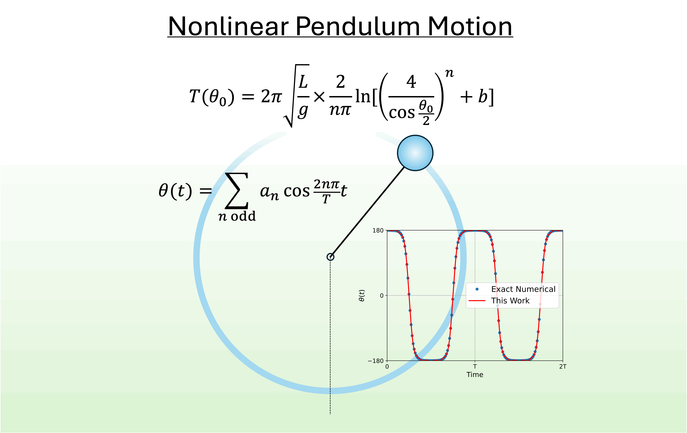

<h1 align="center">Supplemental Material</h1>
<h2 aligne="center">Simple and exact nonlinear pendulum motion for all possible initial conditions</h2>
Teepais Chachiyo <teepanisc@nu.ac.th>, Department of Physics, Faculty of Science, Naresuan University, Phitsanulok 65000, Thailand.

<br>
<br>
The research article preprint >> <a href="https://arxiv.org/abs/2504.16816">https://arxiv.org/abs/2504.16816</a>

<br>
<br>
</center>

## Citation

If you use any part of this repository please cite the following paper:

```
@article{Chachiyo:2025sac,
    author = "Teepanis Chachiyo",
    title = "{Simple and exact nonlinear pendulum motion for all possible initial conditions}",
    eprint = "2504.16816",
    archivePrefix = "arXiv",
    primaryClass = "physics.class-ph",
    month = "4",
    year = "2025"
}
