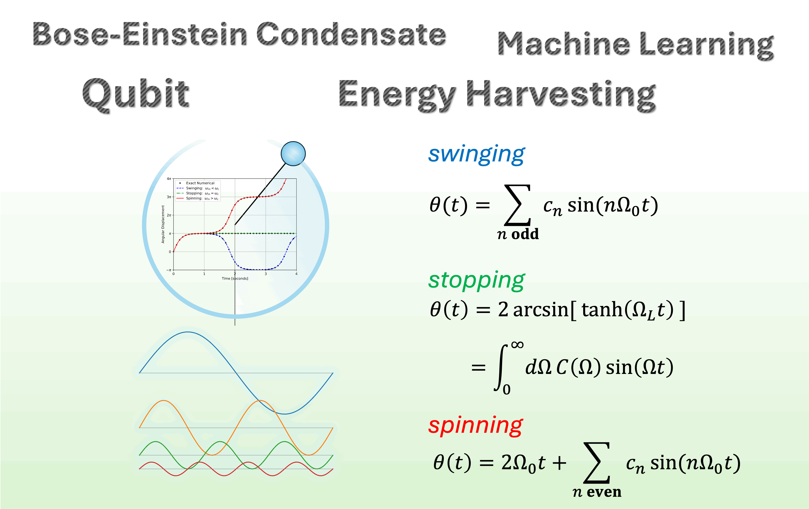
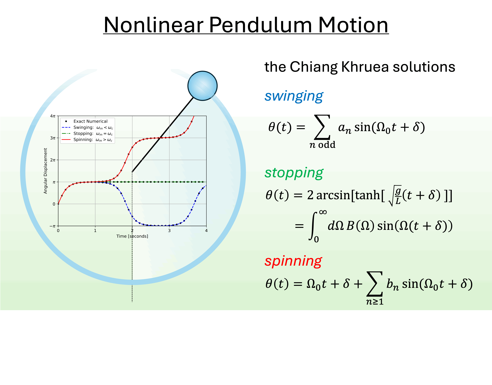

<h1 align="center">Supporting Data</h1>
<h2 aligne="center">Exact frequency-domain solutions for nonlinear pendulum-like dynamics</h2>
Teepanis Chachiyo <teepanisc@nu.ac.th>, Department of Physics, Faculty of Science, Naresuan University, Phitsanulok 65000, Thailand.


## File List
1. **validation.ipynb**: Python notebook producing the results and figures in the paper
2. **simple_example.ipynb**: simple and minimal example of ploting the exact solution 
3. **animation.ipynb**: Python notebook generating GIF animation using the derived exact solutions
4. **nonlinear_motion.gif**: GIF animation showing the 3 classes of motions

<br>
The research article preprint >> <a href="https://arxiv.org/abs/2504.16816">https://arxiv.org/abs/2504.16816</a>

## Abstract
Pendulum-like dynamics underlies a wide range of physical systems, from classical nonlinear oscillators to superconducting circuits and tunneling dynamics in cold-atom platforms. Here we present an exact frequency-domain formulation of the pendulum equation that applies uniformly across oscillatory, separatrix, and rotational regimes. The resulting spectral representation reveals a previously hidden unification: all regimes share the same analytic spectral structure and characteristic frequency scale, differing only by parity selection and the emergence of a continuous spectrum at the separatrix. This framework exposes regime transitions as symmetry-driven reorganizations in frequency space rather than changes in timescale, and identifies the stopping trajectory as a dynamical continuum limit reached without system-size scaling. Beyond providing closed-form solutions, the approach offers a transparent spectral insight into a broad class of classical and quantum pendulum-like systems.

<br>
<br>
<center></center>
<center></center>

## Citation

In the meantime, if you use any part of this repository please cite the following preprint:

```
@article{Chachiyo:2025sae,
    author = "Teepanis Chachiyo",
    title = "{Exact frequency-domain solutions for nonlinear pendulum-like dynamics}",
    eprint = "2504.16816",
    archivePrefix = "arXiv",
    primaryClass = "physics.class-ph",
    month = "4",
    year = "2026"
}
```

## 'Hello-World' example for the swinging nonlinear pendulum

```python
# exact solution of nonlinear pendulum via spectral analyis
# https://github.com/teepanis/nonlinear-pendulum
import numpy as np
import scipy as sp
import matplotlib.pyplot as plt

# physics: amplitude, and OmegaL=sqrt(g/L)
theta0 = 179.9/180*np.pi
OmegaL = np.sqrt(9.8/1)

k = np.sin(theta0/2)
T = 4*sp.special.ellipk(k**2)/OmegaL
Omega0 = 2*np.pi/T
kappa = sp.special.ellipk(1-k**2)

t = np.linspace(0,2*T,200)
theta = np.zeros(len(t)) 

# set phase
delta = np.pi/2

# adding odd harmonics 
for n in range(1,40,2):
    a = 4/n/np.cosh(kappa*n*Omega0/OmegaL)
    theta = theta + a*np.sin(n*Omega0*t + n*delta)

plt.plot(t, theta)
plt.grid()
plt.show()
```

To compare with the traditional perspective we:
1. use the initial condition that the pendulum starts at rest, with an amplitude $\\theta_0$.
2. For this condition, the phase in this work is precisely $\\delta = \\pi/2$.
3. For convenience, we use the form $k = \\sin(\\theta_0/2)$, which is equipvalent to $k = \\omega_m/\\omega_c$.
