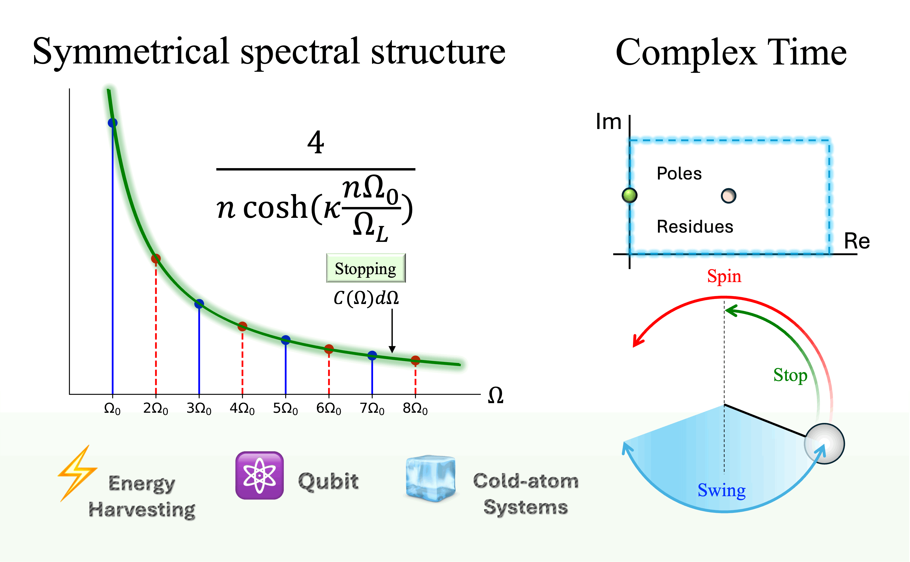
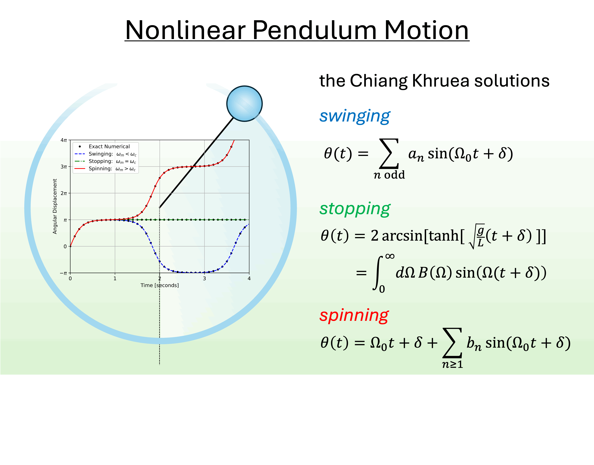

<h1 align="center">Data and Code Availability</h1>
<h2 aligne="center">Unifying pendulum-like dynamical regimes via complex time</h2>
Teepanis Chachiyo <teepanisc@nu.ac.th>, Department of Physics, Faculty of Science, Naresuan University, Phitsanulok 65000, Thailand.


## File List
1. **validation.ipynb**: Python notebook producing the results and figures in the paper
2. **simple_example.ipynb**: simple and minimal example of ploting the exact solution 
3. **animation.ipynb**: Python notebook generating GIF animation using the derived exact solutions
4. **nonlinear_motion.gif**: GIF animation showing the 3 classes of motions

<br>
The research article preprint >> <a href="https://arxiv.org/abs/2504.16816">https://arxiv.org/abs/2504.16816</a>


## Abstract
We present an alternative derivation of exact solutions for pendulum-like systems across all dynamical regimes using a standard technique in undergraduate mathematical physics course: the Cauchy residue theorem, entirely independent from the traditional Jacobi elliptic framework. The solutions are exact in both the time and frequency domains, providing continuous trajectories and precise frequency decompositions. Pendulum-like dynamics is a foundational model across many areas of physics, underlying systems ranging from classical nonlinear oscillators to superconducting qubits and cold-atom tunneling platforms. While its time-domain solutions are well-known in terms of Jacobi elliptic functions, its obscured frequency-domain solutions have led a large body of theoretical and experimental work to develop and apply approximate methods when studying its spectral behavior. We discover that all regimes arise from a single spectral kernel, with parity selection distinguishing the periodic motions and the separatrix representing their discrete-to-continuum limit. Regime changes thus correspond to symmetry-driven reorganizations in frequency space rather than changes in the underlying spectral structure, with the stopping trajectory representing the continuum limit. By completely bypassing the traditional Jacobi elliptic functions, and relying on the symmetrical structure of the complex time plane, the derivation shows that the symmetrical spectral structure is not merely algebraic artifacts of elliptic integrals, but fundamentally connected to the dynamical symmetries of the system. The derivation presented here not only serves as a powerful pedagogical exercise for this long-standing physics problem, but also reveals a highly symmetrical spectral organization in nonlinear dynamics.

<br>
<br>
<center></center>
<center></center>


## Citation

In the meantime, if you use any part of this repository please cite the following preprint:

```
@article{Chachiyo:2026uss,
    author = "Teepanis Chachiyo",
    title = "{Universal spectral structure in pendulum-like systems}",
    eprint = "2504.16816",
    archivePrefix = "arXiv",
    primaryClass = "physics.class-ph",
    month = "4",
    year = "2026"
}
```


## 'Hello-World' example for the swinging nonlinear pendulum

```python
# exact solution of nonlinear pendulum via spectral analyis
# https://github.com/teepanis/nonlinear-pendulum
import numpy as np
import scipy as sp
import matplotlib.pyplot as plt

# physics: amplitude, and OmegaL=sqrt(g/L)
theta0 = 179.9/180*np.pi
OmegaL = np.sqrt(9.8/1)

k = np.sin(theta0/2)
T = 4*sp.special.ellipk(k**2)/OmegaL
Omega0 = 2*np.pi/T
kappa = sp.special.ellipk(1-k**2)

t = np.linspace(0,2*T,200) + T/4
theta = np.zeros(len(t)) 

# adding odd harmonics 
for n in range(1,40,2):
    c = 4/n/np.cosh(kappa*n*Omega0/OmegaL)
    theta = theta + c*np.sin(n*Omega0*t)

plt.plot(t, theta)
plt.grid()
plt.show()
```

To compare with the traditional perspective we:
1. use the initial condition that the pendulum starts at rest, with an amplitude $\\theta_0$.
2. For this condition, we shift the time by $T/4$.
3. For convenience, we use the form $k = \\sin(\\theta_0/2)$, which is equipvalent to $k = \\omega_m/\\omega_c$.
