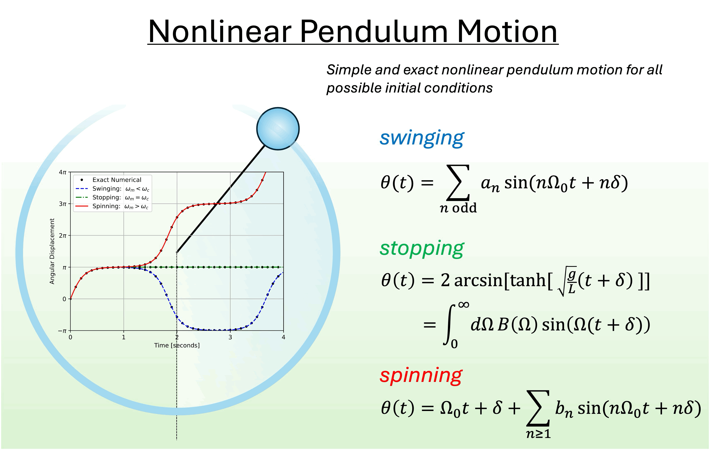

<h1 align="center">Supplemental Material</h1>
<h2 aligne="center">Simple and exact nonlinear pendulum motion for all possible initial conditions</h2>
Teepais Chachiyo <teepanisc@nu.ac.th>, Department of Physics, Faculty of Science, Naresuan University, Phitsanulok 65000, Thailand.


## File List
1. **supplemental_material.ipynb**: additional proofs, figures, and data as shown in the paper
2. **CKS_animation.ipynb**: a python code that generates GIF animation using CKS.
3. **nonlinear_motion.gif**: example of the generated GIF animation

<br>
<br>
The research article preprint >> <a href="https://arxiv.org/abs/2504.16816">https://arxiv.org/abs/2504.16816</a>

<br>
<br>
<center></center>
<center></center>

## Citation

In the meantime, if you use any part of this repository please cite the following preprint:

```
@article{Chachiyo:2025sae,
    author = "Teepanis Chachiyo",
    title = "{Simple and exact nonlinear pendulum motion for all possible initial conditions}",
    eprint = "2504.16816",
    archivePrefix = "arXiv",
    primaryClass = "physics.class-ph",
    month = "4",
    year = "2025"
}
