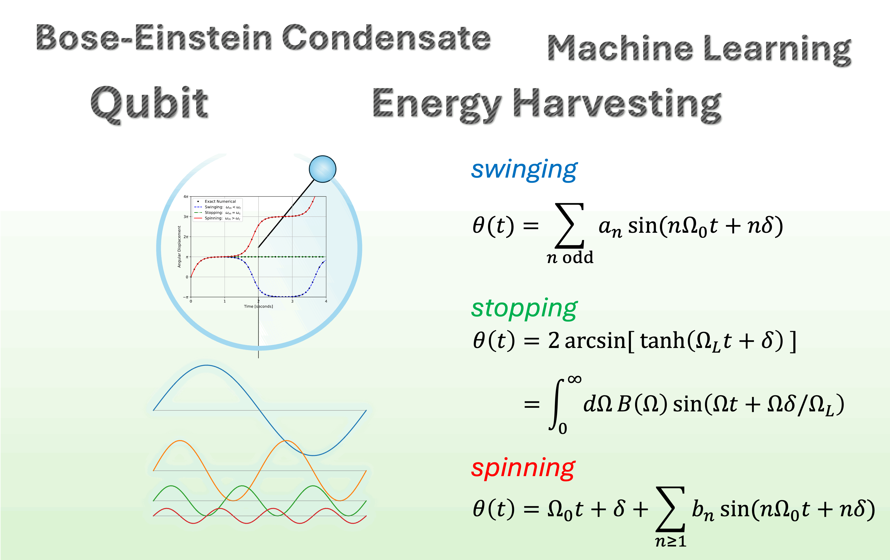

<h1 align="center">Supplemental Material</h1>
<h2 aligne="center">Simple and exact nonlinear pendulum motion for all possible initial conditions</h2>
Teepanis Chachiyo <teepanisc@nu.ac.th>, Department of Physics, Faculty of Science, Naresuan University, Phitsanulok 65000, Thailand.


## File List
1. **supplemental_material.ipynb**: a python notebook with additional proofs and figures as shown in the paper
2. **animation.ipynb**: a python notebook generating GIF animation using the derived exact solutions.
3. **nonlinear_motion.gif**: example of the generated GIF animation

<br>
The research article preprint >> <a href="https://arxiv.org/abs/2504.16816">https://arxiv.org/abs/2504.16816</a>

## Abstract
Despite centuries of investigation, exact solutions describing nonlinear pendulum motion in the frequency domain have remained elusive. Existing formulations, while mathematically exact in the time domain via Jacobi elliptic functions, do not directly yield tractable, closed-form expressions for the frequency content of the motion, limiting both theoretical understanding and practical applications. This work presents complete, exact, and closed-form frequency-domain solutions for energy-conserving nonlinear pendulum motion across all regimes: swinging, stopping, and spinning. These solutions are derived through an angular velocity frequency analysis, and expressed in terms of elementary functions. The exact frequency contents are validated by their agreement with exact numerical values to machine precision, and by frequency analysis of dynamical simulations performed using Velocity Verlet integration. A comparison to the perturbation method is presented. Applications to quantum analogues, such as superconducting Josephson junctions and Bose-Einstein condensate tunneling, are discussed.

<br>
<br>
<center></center>
<center></center>

## Citation

In the meantime, if you use any part of this repository please cite the following preprint:

```
@article{Chachiyo:2025sae,
    author = "Teepanis Chachiyo",
    title = "{Simple and exact nonlinear pendulum motion for all possible initial conditions}",
    eprint = "2504.16816",
    archivePrefix = "arXiv",
    primaryClass = "physics.class-ph",
    month = "4",
    year = "2025"
}
